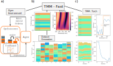

# tmm_fast

tmm_fast or transfer-matrix-method_fast is a lightweight package to speed up optical planar multilayer thin-film device computation. 
Typically, one is interested in computing the Reflection and/or Transmission of light through a multilayer thin-film depending on the 
wavelength and angle of incidence of the incoming light. The package is build on the [original tmm package](https://github.com/sbyrnes321/tmm) from sjbyrnes but quite a lot faster. Depending on the number of layers, wavelength range and angular range speed-ups of ~100x are possible. The physics behind the transfer matrix method can be studied in any textbook on optical devices or in [Multilayer optical calculations](https://arxiv.org/abs/1603.02720)
from Steven J. Byrnes.
More detailed information about the package and its applications can be found in [TMM-Fast: A Transfer Matrix Computation Package for Multilayer Thin-Film Optimization](https://arxiv.org/abs/2111.13667).


<br/>

<!-- GETTING STARTED -->
## Getting Started

To get a local copy up and running follow these simple steps.

### Prerequisites

tmm_fast requires some prerequisites:
* Numpy
* PyTorch >= 1.9
* Dask
* Matplotlib
* Seaborn 
* Gym
  ```sh
  pip install numpy pytorch>=1.9.1 dask matplotlib seaborn gym
  ```

### Installation

1. Clone the repo
   ```sh
   git clone https://github.com/MLResearchAtOSRAM/tmm_fast.git
   ```

In case any dependency is not fulfilled, you can create an environment using gym_multilayerthinfilm.yml which is located in the package folder; don't forget to specify your python environment folder/path there (prefix).<br/>
In general, there are no weird dependencies aside from numpy, matplotlib, seaborn, dask and gym. The tmm package can be downloaded/installed from here if necessary:<br/>
pip install git+https://github.com/sbyrnes321/tmm.git 

## unified functionality of tmm_fast: Sponge PyTorch functionality for free
Parallelized computation of reflection and transmission for coherent light spectra that traverse
a bunch of multilayer thin-films with dispersive materials.
This package is essentially build on Pytorch and its related functionalities such as GPU accelerations and Autograd.
It naturally allows for:
 - GPU accelerated computations
 - To compute gradients regarding the multilayer thin-film (i.e. N, T) thanks to Pytorch Autograd
 - Vectorized computations, i.e. using Einstein summation convention

In general, tmm_fast is a lightweight package to speed up the computations of reflection and transmission of optical planar multilayer thin-films by vectorization regarding
- a set of multilayer thin-films consisting of various layers of particular material and thickness,
- a set of wavelengths, and
- a set of incident angles.
 
### For old guards: Numpy is fully supported
All of the inputs can also be a numpy array format instead of torch tensors.
However, all internal computations are processed via PyTorch and thus the output data is converted back to numpy arrays again.
Hence, the use of numpy input may increase computation time due to data type conversions.

### Benefits and conducted sanity checks, backgrounds
Depending on the number of thin films an their number of layers as well as the considered wavelengths that irradiate the thin film under particular angles of incident, the computation time can be decreased by 2-3 orders of magnitude.
This claim is supported by several cross-checks (https://arxiv.org/abs/2111.13667), conducted with the code provided by Steven J. Byrnes (https://arxiv.org/abs/1603.02720). Of course, the checks covered both, computational time and physical outputs.

The physics behind the transfer matrix method can be studied in any textbook on optical devices or related papers, e.g.
- Chapter on thin films in Microphotonics (http://www.photonics.intec.ugent.be/download/ocs129.pdf) by Dries Van Thourhout, Roel Baets (UGent) and Heidi Ottevaere (VUB)
- Multilayer optical computations (https://arxiv.org/abs/1603.02720) by Steven J. Byrnes
- The Fresnel Coefficient of Thin Film Multilayer Using Transfer Matrix Method (https://iopscience.iop.org/article/10.1088/1757-899X/518/3/032026) by Zahraa Hummam Mohammed

## gym-multilayerthinfilm

The proposed OpenAI gym environment utilizes the parallelized transfer-matrix method (TMM-Fast) to implement the optimization of multi-layer thin films as parameterized Markov decision processes. An very intuitive example is provided in example.py.
Whereas the contained physical methods are well-studied and known since decades, the contribution of this code lies the transfer to an OpenAI gym environment. The intention is to enable AI researchers without optical expertise to solve the corresponding parameterized Markov decision processes. Due to their structure, the solution of such problems is still an active field of research in the AI community.<br/>
The publication [Parameterized Reinforcement learning for Optical System Optimization](https://iopscience.iop.org/article/10.1088/1361-6463/abfddb) used this environment.


### Getting started
To get started you can do the example py-files for tmm (example_tmm.py) or the gym environment (example_gym.py)!

### Multi-layer thin films meet parameterized reinforcement learning
Reinforcement learning is an area of machine learning concerned with how intelligent agents ought to take actions in an environment in order to maximize the notion of reward. The code to be published implements such an environment for the optimization of multi-layer thin films.
In principle, the proposed code allows to execute actions taken by an agent. These actions determine which material and with which thickness to stack next, thereby consecutively forming a multi-layer thin film as illustrated in Figure 1. Such a multilayer thin-film exhibits optical characteristics. By comparison between the actual and user-defined desired characteristics, a notion of numeric reward is computed based on which the agent learns to distinguish between good and bad design choices. Due to its physical and mathematical structure, the optimization of multi-layer thin film remains a challenging and thus still active field of research in the scientific community. As such it gained recent attention in many publications. Therefore, naturally the need for a standardized environment arises to make the corresponding research more trustful, comparable and consistent.

<br/> 
Figure 1: Principal idea of an OpenAI gym environment. The agent takes an action that specifies the material and thickness of the layer to stack next. The environment implements the multi-layer thin film generation as consecutive conduction of actions and assigns a reward to a proposed multi-layer thin film based on how close the actual (solid orange line) fulfils a desired (dashed orange line) characteristic. The made experience is used to adapt the taken actions made in order to increase the reward and thus generate more and more sophisticated multi-layer thin films.

# Description of key features
The environment can include<br/> 
•	cladding of the multi-layer thin film (e.g. substrate and ambient materials),<br/>
•	dispersive and dissipative materials,<br/>
•	spectral and angular optical behavior of multi-layer thin films (See figure 2),<br/>
•	… and many more.<br/>

The environment class allows to <br/>
•	conduct so-called parameterized actions (See publication) that define a multi-layer thin film,<br/>
•	evaluate the generated thin film given a desired optical response, and<br/>
•	render the results (See figure 2). <br/>

In general, the comprehensive optimization of multi-layer thin films in regards of optical response encompasses <br/>
•	the number of layers (integer),<br/>
•	the thickness of each layer (float),<br/>
•	the material of each layer (categorical, integer).<br/>

<br/> 
Figure 2: Rendered output of the environment. Reflectivity (left) over angle of incidence and spectrum of a multi-layer thin film (right). Here, the stack features four layers and each layer’s material was chosen from a set of eight alternatives. The reward is computed based on a desired reflectivity, which is one for each angle and wavelength, but not displayed in this figure.


# Citing
If you use the code from this repository for your projects, please cite:
[TMM-Fast: A Transfer Matrix Computation Package for Multilayer Thin-Film Optimization](https://arxiv.org/abs/2111.13667) in your publications.
